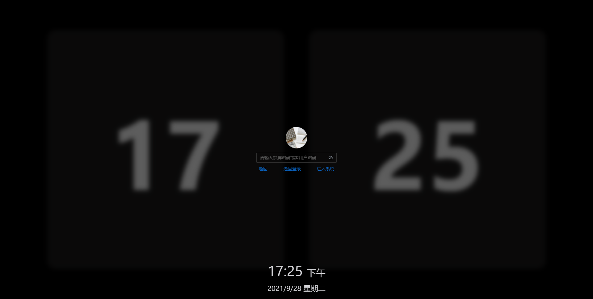
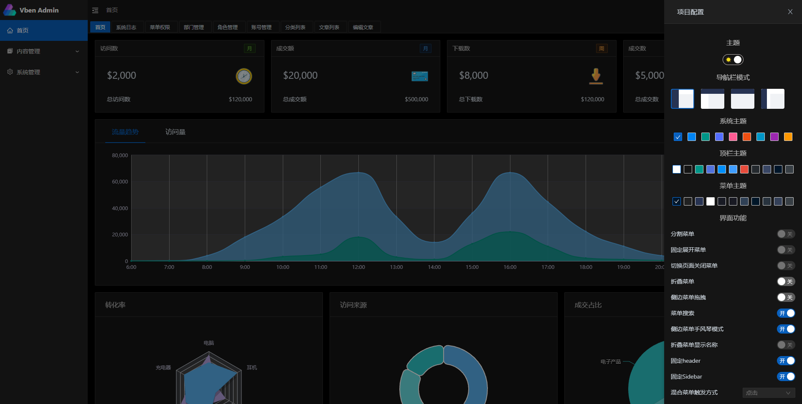
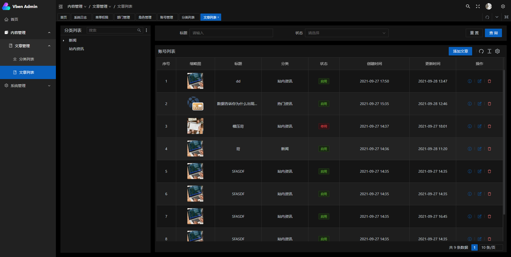
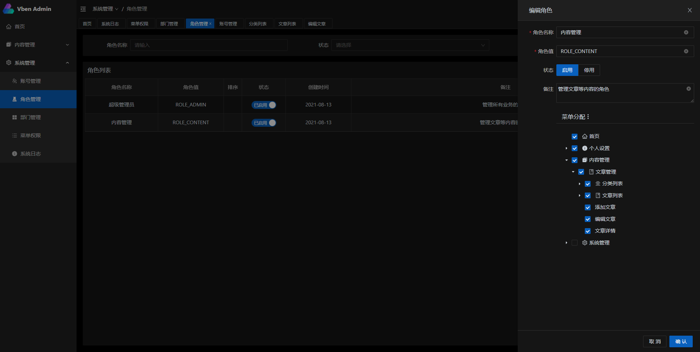
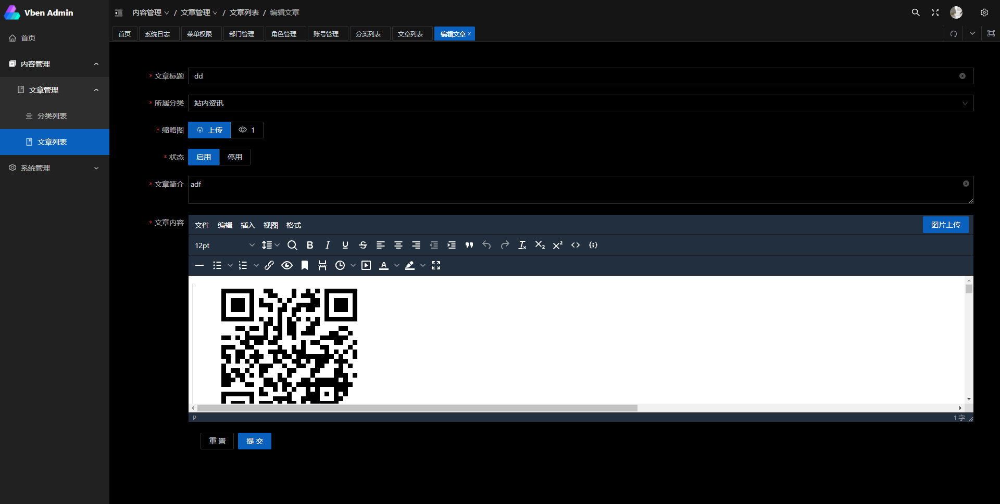

Vben Admin Java
===================================
这是一个Spring Boot的基础项目，前后端分离，前端修改自开源项目 https://github.com/anncwb/vue-vben-admin  Vue3 + ts

管理后台： http://127.0.0.1:20004 (账号：admin, 密码:Aa000000) 

Api端服务： http://127.0.0.1:20001 (/api/user/login  /api/user/register /api/user/info)

管理后台的模板项目 [vue-vben-admin](https://github.com/xiaomalover/vue-vben-admin "Vue Vben Admin"). 采用vue3 + ts编写

目录结构
--------

```
admin-server                            管理后台服务
api-server                              接口服务
common-lib                              公共资源
generator                               基于Mybatis-plus的生成工具
```

运行
--------
1, 先导入根目录下的数据库

2, 启动管理后台，API服务

3, Api服务测试请用postman 导入要目录下的 xm_boot.postman_collection.json

功能
-------

1. 完整的后台管理基础功能，包含权限管理RBAC（JWT + Security），文章管理（tinymce编辑器），图片上传（支持本地和oss，只需修改配置文件就能简单切换）
2. 简单的Api服务，用户注册，登录，token存储redis
3. 代码自动生成，可自己指定生成模块，基于Mybatis-Plus实现

    ...

开发注意
---------
开发后台模板，请先安装nodeJS和yarn到你的系统，然后进入vue-vben-admin目录中依次执行(这里是模板项目vue-vben-admin)
```
$ yarn install
$ yarn serve
```
如果开发完成了，请执行以下命令, 然后把dist目录里生成的资源文件拷贝到后台项目（vben admin java）对应的admin-server的resources的static目录下。
```
$ yarn build
```

项目截屏
---------














联系作者
---------
如果有任何安装问题，请加我微信，如果你觉得对你有用，请帮忙star, 让更多人看到此项目，希望能帮到大家。


